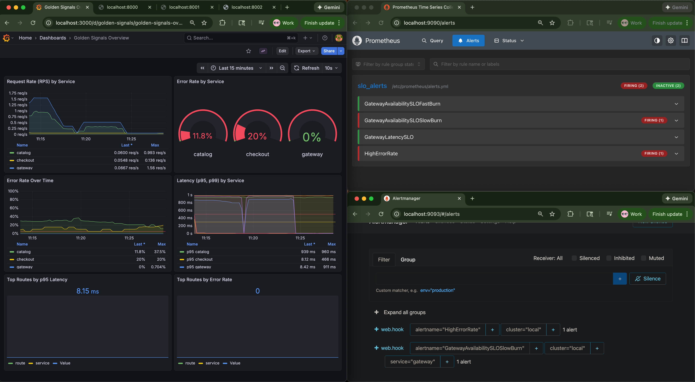
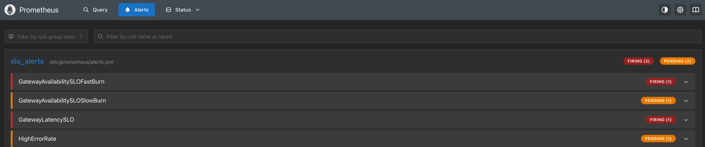
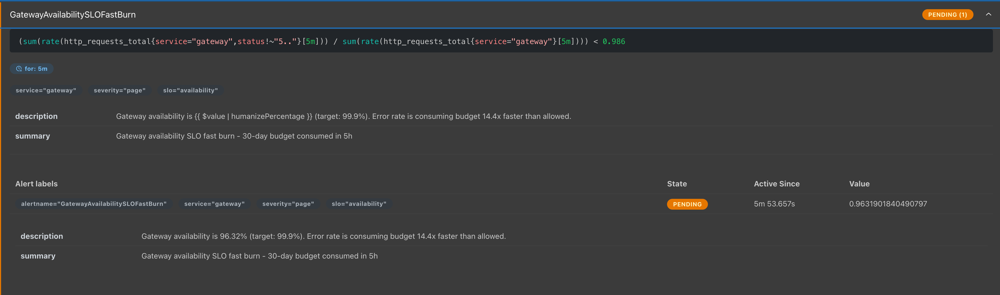
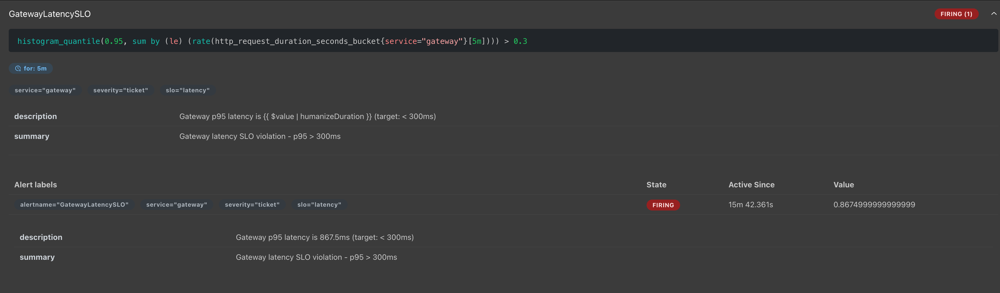
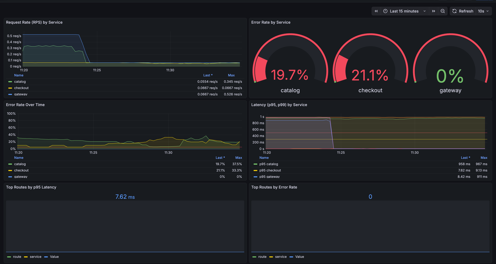
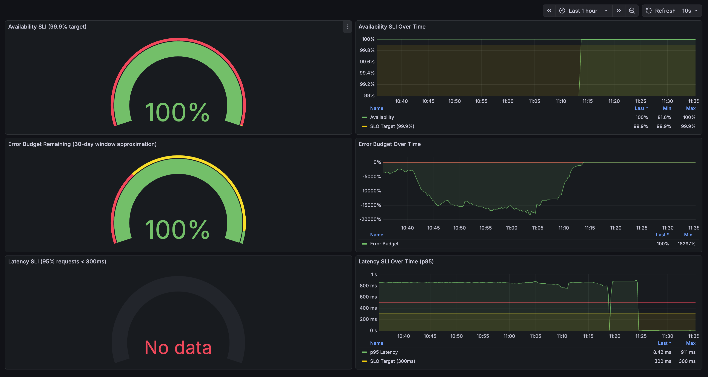
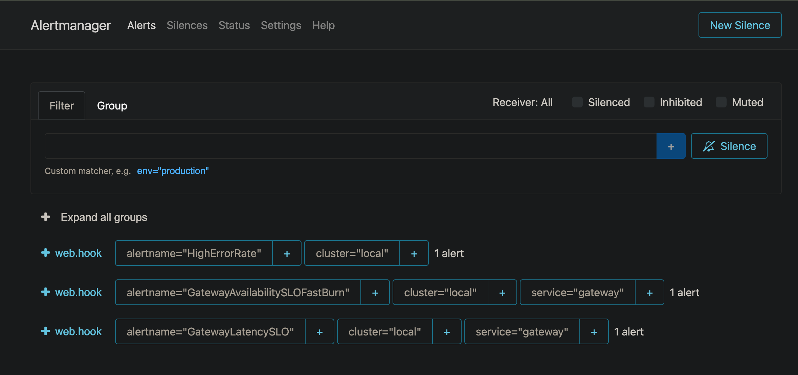

# Foreword

This is a practice project to understand the Grafana (LGTM) observability stack.

# 3-Service Observability Lab

A complete observability demonstration using the LGTM stack (Loki, Grafana, Tempo, Mimir/Prometheus) with 3 microservices, showcasing correlated metrics, logs, traces, and SLO-driven alerting.



## Challenges This Demo Solves

This lab addresses common observability challenges in modern microservices environments:

- **Correlation Complexity**: Connecting metrics, logs, and traces across distributed services is non-trivial. This demo shows how to achieve end-to-end correlation using trace IDs and span IDs.
- **SLO Implementation**: Defining and monitoring Service Level Objectives (SLOs) with proper error budget tracking and burn rate alerting can be overwhelming. This lab provides a working example with availability and latency SLOs.
- **Full-Stack Observability**: Many teams struggle to integrate the full observability stack (metrics, logs, traces) cohesively. This demo demonstrates a complete, production-realistic setup.
- **Hands-On Learning**: Reading documentation is one thing, but seeing how everything works together in a runnable environment accelerates understanding significantly.

## Who Is This For?

- **SREs & DevOps Engineers**: Learn how to implement a complete observability stack and SLO-driven alerting in practice
- **Platform Engineers**: Understand how to set up and configure the LGTM stack for your teams
- **Software Developers**: See how to instrument services with OpenTelemetry and emit observability signals
- **Engineering Teams**: Use this as a reference implementation for your own observability infrastructure

## Benefits

- **Production-Realistic**: Uses real tools (Prometheus, Loki, Tempo, Grafana) in a configuration that mirrors production environments
- **Single Command Setup**: Get everything running with `docker compose up -d` - no complex setup required
- **End-to-End Correlation**: See how metrics, logs, and traces connect together using trace IDs and exemplars
- **SLO-Driven Alerting**: Learn burn rate alerting and error budget management with working examples
- **Chaos Engineering**: Includes fault injection capabilities to test your observability setup
- **Complete & Runnable**: Everything works out of the box - no placeholders or TODOs


## Architecture

```
┌─────────┐
│ Gateway │ (port 8000)
└────┬────┘
     │
     ├─→ ┌─────────┐
     │   │ Catalog │ (port 8001)
     │   └─────────┘
     │
     └─→ ┌──────────┐
         │ Checkout │ (port 8002)
         └──────────┘

Observability Stack:
- Prometheus (port 9090) - Metrics collection
- Loki (port 3100) - Log aggregation
- Promtail - Log collection
- Tempo (ports 4317/4318/3200) - Trace storage
- Grafana (port 3000) - Visualization
- Alertmanager (port 9093) - Alert routing
```

## Prerequisites

- Docker 20.10+ and Docker Compose 2.0+
- 4GB+ RAM available
- Ports available: 3000, 8000, 8001, 8002, 9090, 9093, 3100, 4317, 4318, 3200

## Quick Start

### 1. Start the Stack

```bash
docker compose up -d
```

Wait 30-60 seconds for all services to be healthy. Check status:

```bash
docker compose ps
```

### 2. Access Services

- **Grafana**: http://localhost:3000 
  - Username: `admin`
  - Password: `admin`
  - (On first login, you'll be prompted to change the password - you can skip this for local development)
- **Prometheus**: http://localhost:9090
- **Alertmanager**: http://localhost:9093
- **Gateway API**: http://localhost:8000
- **Catalog API**: http://localhost:8001
- **Checkout API**: http://localhost:8002

#### Connecting to Grafana

1. **Start the services** (if not already running):
   ```bash
   docker compose up -d
   ```

2. **Wait for Grafana to be ready** (about 10-30 seconds):
   ```bash
   docker compose ps grafana
   # Should show "Up" status
   ```

3. **Open your browser** and navigate to:
   ```
   http://localhost:3000
   ```

4. **Login with default credentials**:
   - Username: `admin`
   - Password: `admin`

5. **Optional**: Change password (you can click "Skip" for local development)

Once logged in, you'll see:
- **Dashboards** automatically loaded: "Golden Signals Overview" and "SLO & Error Budget"
- **Data sources** already configured: Prometheus, Loki, and Tempo
- **Explore** section to query metrics, logs, and traces

**Note**: Datasources are configured with basic settings. Advanced correlation features (exemplars, derived fields) can be added through the Grafana UI if needed.

### 3. Generate Traffic

**Important**: You need to generate traffic for data to appear in Grafana!

```bash
# Option 1: Quick load (generates 300 requests then stops)
make load-quick
# Wait 30 seconds, then refresh Grafana dashboards

# Option 2: Continuous load (runs forever - press Ctrl+C to stop)
make load
# Keep this running in a terminal while viewing Grafana

# Option 3: Manual requests
curl http://localhost:8000/
curl http://localhost:8000/browse
curl -X POST http://localhost:8000/purchase \
  -H "Content-Type: application/json" \
  -d '{"items": [{"id": "1", "price": 19.99, "quantity": 1}]}'
```

**Note**: `make load` runs continuously (this is normal!). It's designed to keep generating traffic. Press `Ctrl+C` to stop it. Use `make load-quick` for a one-time load generation.

## Usage

### Generate Load

The Makefile includes load generators:

```bash
# Quick load (generates 300 requests, then stops)
make load-quick

# Continuous load (runs forever, press Ctrl+C to stop)
make load
```

**Note**: `make load` runs continuously - this is intentional! It keeps generating traffic. Press `Ctrl+C` to stop it. For a one-time load, use `make load-quick`.

### Chaos Engineering

Inject latency and errors into services to test your observability setup:

#### Basic Chaos Commands

```bash
# Add 500ms latency to catalog
make chaos-latency SERVICE=catalog LATENCY=500

# Add 10% error rate to checkout
make chaos-errors SERVICE=checkout RATE=0.1

# Reset chaos (set to 0)
make chaos-reset SERVICE=catalog
```

#### High Error Rate Examples

**Trigger 50% error rate:**
```bash
make chaos-errors SERVICE=gateway RATE=0.5
```

**Trigger 100% error rate (complete failure):**
```bash
make chaos-errors SERVICE=gateway RATE=1.0
```

**Trigger multiple services:**
```bash
# Inject errors on all services
make chaos-errors SERVICE=gateway RATE=0.3
make chaos-errors SERVICE=catalog RATE=0.3
make chaos-errors SERVICE=checkout RATE=0.3
```

**See "Triggering Alerts and High Error Rates" section below for more detailed examples.**

**Manual Method:** Edit `docker-compose.yml` to change `CHAOS_LATENCY_MS` or `CHAOS_ERROR_RATE` for the service, then restart:

```bash
docker compose stop catalog
docker compose up -d catalog
```

### View Logs

```bash
# All services
make logs

# Specific service
docker compose logs -f gateway
docker compose logs -f catalog
docker compose logs -f checkout
```

### Stop the Stack

```bash
make down
# or
docker compose down
```

To also remove volumes (clean slate):

```bash
docker compose down -v
```

## Observability Features

### Metrics (Prometheus)

All services expose Prometheus metrics at `/metrics`:

- `http_requests_total` - Request counter with labels: `service`, `route`, `method`, `status`
- `http_request_duration_seconds` - Request latency histogram





**Key Metrics:**
- Request rate per service/route
- Error rate per service/route
- p50, p95, p99 latency per service/route

### Logs (Loki)


All services emit structured JSON logs to stdout with:
- `timestamp`, `level`, `service`, `route`, `method`, `status`
- `latency_ms`, `trace_id`, `span_id`, `msg`

Promtail collects logs from Docker containers and ships to Loki with labels:
- `job=services`, `service`, `env=local`


### Traces (Tempo)

Distributed tracing via OpenTelemetry:
- OTLP gRPC exporter (port 4317)
- Trace context propagates: gateway → catalog/checkout
- Traces include service names, operation names, and attributes

### Correlation

**Metrics → Traces:**
1. In Grafana Explore, query metrics
2. Click on a data point
3. Use "Exemplars" to jump to related traces

**Traces → Logs:**
1. In Grafana Explore, select Tempo datasource
2. View a trace
3. Click on a span to see correlated logs (trace_id matching)

**Logs → Traces:**
1. In Grafana Explore, query Loki logs
2. Click on `trace_id` field
3. Jump to Tempo to view full trace

## Grafana Dashboards

Two dashboards are automatically provisioned:

### 1. Golden Signals Overview

Displays:
- Request rate (RPS) by service
- Error rate by service
- Latency (p95, p99) by service
- Top routes by latency
- Top routes by error rate



### 2. SLO & Error Budget


Displays:
- **Availability SLI**: 99.9% successful requests (non-5xx) for gateway
- **Error Budget**: Remaining budget for 30-day window
- **Latency SLI**: 95% of requests under 300ms (p95 thresholding)

**SLO Specifications:**
- Availability: 99.9% over 30 days for gateway service
- Latency: 95% requests under 300ms over 30 days for gateway service

**Burn Rate Alerts:**
- Fast burn: 14.4x error rate (consumes 30-day budget in 5 hours) → Page alert
- Slow burn: 6x error rate (consumes 30-day budget in 6 hours) → Ticket alert
- Latency alert: p95 > 300ms → Ticket alert

## Alerting


Alerts are configured in `prometheus/alerts.yml` and evaluated by Prometheus. Alertmanager routes them based on severity:

- **severity: page** - Fast-burn availability violations (immediate attention)
- **severity: ticket** - Slow-burn availability and latency violations (investigate)

View active alerts:
- Prometheus: http://localhost:9090/alerts
- Alertmanager: http://localhost:9093

### Triggering Alerts and High Error Rates

#### Quick Commands to Trigger High Error Rates

**Trigger 50% error rate (will quickly consume error budget):**
```bash
# On gateway (affects SLO directly)
make chaos-errors SERVICE=gateway RATE=0.5

# On catalog (affects gateway when browsing)
make chaos-errors SERVICE=catalog RATE=0.5

# On checkout (affects gateway when purchasing)
make chaos-errors SERVICE=checkout RATE=0.5
```

**Trigger 100% error rate (complete service failure):**
```bash
make chaos-errors SERVICE=gateway RATE=1.0
```

**Trigger moderate error rate (10-20% - slow burn):**
```bash
# 10% error rate
make chaos-errors SERVICE=gateway RATE=0.1

# 20% error rate
make chaos-errors SERVICE=gateway RATE=0.2
```

**Trigger high latency (affects latency SLO):**
```bash
# 1 second latency
make chaos-latency SERVICE=gateway LATENCY=1000

# 2 seconds latency
make chaos-latency SERVICE=gateway LATENCY=2000
```

**Combine errors and latency:**
```bash
# First inject errors
make chaos-errors SERVICE=gateway RATE=0.3

# Then inject latency (in separate terminal or after)
make chaos-latency SERVICE=gateway LATENCY=500
```

#### Testing SLO Violations

**To trigger Fast-Burn Alert (Page - 14.4x error rate):**
```bash
# This will consume 30-day error budget in ~5 hours
# Need error rate that makes availability < 98.6%
make chaos-errors SERVICE=gateway RATE=0.15

# Generate traffic to see the effect
make load
```

**To trigger Slow-Burn Alert (Ticket - 6x error rate):**
```bash
# This will consume 30-day error budget in ~6 hours
# Need error rate that makes availability < 99.3%
make chaos-errors SERVICE=gateway RATE=0.08

# Generate traffic
make load
```

**To trigger Latency Alert:**
```bash
# p95 > 300ms threshold
make chaos-latency SERVICE=gateway LATENCY=500

# Generate traffic
make load
```

#### Complete Test Scenario

Here's a complete workflow to test error handling:

```bash
# 1. Start with clean state
make chaos-reset SERVICE=gateway
make chaos-reset SERVICE=catalog
make chaos-reset SERVICE=checkout

# 2. Generate baseline traffic
make load
# Let it run for 1-2 minutes, then stop (Ctrl+C)

# 3. Inject high error rate on gateway
make chaos-errors SERVICE=gateway RATE=0.5

# 4. Generate traffic to see errors
make load
# Watch Grafana dashboards - you should see:
# - Error rate spike in "Golden Signals Overview"
# - Error budget depleting in "SLO & Error Budget"
# - Alerts firing in Prometheus (http://localhost:9090/alerts)

# 5. Check alerts
# Visit: http://localhost:9090/alerts
# Visit: http://localhost:9093

# 6. Reset to normal
make chaos-reset SERVICE=gateway
```

#### Monitoring Error Rates

While error rates are active, monitor them:

**In Grafana:**
1. Open "Golden Signals Overview" dashboard
2. Watch the "Error Rate by Service" panel
3. Check "SLO & Error Budget" dashboard for error budget consumption

**In Prometheus:**
```bash
# Query error rate
# Visit: http://localhost:9090
# Query: rate(http_requests_total{service="gateway",status=~"5.."}[5m]) / rate(http_requests_total{service="gateway"}[5m])
```

**In Loki (logs):**
```bash
# Query error logs
# In Grafana Explore → Loki
# Query: {service="gateway"} |= "ERROR"
```

#### Reset After Testing

```bash
# Reset all services
make chaos-reset SERVICE=gateway
make chaos-reset SERVICE=catalog
make chaos-reset SERVICE=checkout
```

**Note:** Wait 5-10 minutes after injecting errors for alerts to fire (depending on evaluation interval). Alerts are evaluated every 30 seconds as configured in `prometheus/alerts.yml`.

## Service APIs

### Gateway (port 8000)

- `GET /` - Health check
- `GET /browse` - Browse catalog (calls catalog service)
- `POST /purchase` - Purchase items (calls checkout service)
- `GET /metrics` - Prometheus metrics

### Catalog (port 8001)

- `GET /` - Health check
- `GET /items` - List catalog items
- `GET /metrics` - Prometheus metrics

**Chaos Injection:**
- `CHAOS_LATENCY_MS` - Add latency (milliseconds)
- `CHAOS_ERROR_RATE` - Error rate (0.0-1.0)

### Checkout (port 8002)

- `GET /` - Health check
- `POST /checkout` - Process checkout/payment
- `GET /metrics` - Prometheus metrics

**Chaos Injection:**
- `CHAOS_LATENCY_MS` - Add latency (milliseconds)
- `CHAOS_ERROR_RATE` - Error rate (0.0-1.0)

## Exploring Correlation in Grafana

### Step 1: Find a trace from metrics

1. Open Grafana → Explore → Prometheus
2. Query: `rate(http_requests_total{service="gateway"}[5m])`
3. Click on a data point → View exemplars
4. Click on an exemplar to jump to Tempo trace

### Step 2: View logs from a trace

1. Open Grafana → Explore → Tempo
2. Search for traces by service name or operation
3. Click on a trace to view spans
4. Click on a span → "Logs for this span" to see correlated logs

### Step 3: Find traces from logs

1. Open Grafana → Explore → Loki
2. Query: `{service="gateway"} |= "ERROR"`
3. Click on a log line with `trace_id`
4. Click on the `trace_id` value → Jump to Tempo

### Step 4: View SLO dashboards

1. Navigate to "SLO & Error Budget" dashboard
2. Observe availability SLI and error budget
3. Inject chaos to see SLO violations
4. Check Prometheus alerts to see when thresholds are breached

## Troubleshooting

### No Data in Grafana Dashboards

If you don't see any data in Grafana, follow these steps:

1. **Verify services are running:**
   ```bash
   docker compose ps
   # All services should show "Up" status
   ```

2. **Generate traffic to your services:**
   ```bash
   # Option 1: Use the load generator (recommended)
   make load
   
   # Option 2: Generate some test requests manually
   curl http://localhost:8000/
   curl http://localhost:8000/browse
   curl -X POST http://localhost:8000/purchase \
     -H "Content-Type: application/json" \
     -d '{"items": [{"id": "1", "price": 19.99, "quantity": 1}]}'
   ```
   **Important**: You need to generate traffic before data will appear! The dashboards show metrics from actual requests.

3. **Check if metrics are being collected:**
   ```bash
   # Check Prometheus targets (all should be "UP")
   # Visit: http://localhost:9090/targets
   
   # Or via command line:
   curl -s http://localhost:9090/api/v1/targets | python3 -m json.tool | grep -A 2 "health"
   ```

4. **Verify metrics are exposed:**
   ```bash
   # Check gateway metrics
   curl http://localhost:8000/metrics | grep http_requests_total
   
   # Check catalog metrics
   curl http://localhost:8001/metrics | grep http_requests_total
   
   # Check checkout metrics
   curl http://localhost:8002/metrics | grep http_requests_total
   ```

5. **Check Prometheus is scraping:**
   - Visit http://localhost:9090
   - Go to Status → Targets
   - All three services (gateway, catalog, checkout) should show as "UP"

6. **Verify Grafana datasources:**
   - In Grafana, go to Configuration → Data Sources
   - You should see Prometheus, Loki, and Tempo
   - Click on each and click "Save & Test" - all should show "Data source is working"

7. **Check dashboard time range:**
   - In Grafana dashboards, check the time picker (top right)
   - Set it to "Last 15 minutes" or "Last 1 hour"
   - Click "Apply"

8. **Wait for data collection:**
   - After generating traffic, wait 15-30 seconds
   - Prometheus scrapes every 15 seconds (configured in prometheus.yml)
   - Refresh the dashboard

### Services not starting

```bash
# Check logs
docker compose logs gateway
docker compose logs catalog
docker compose logs checkout

# Restart a service
docker compose restart gateway
```

### No metrics appearing

1. Verify services are exposing metrics:
   ```bash
   curl http://localhost:8000/metrics
   ```

2. Check Prometheus targets: http://localhost:9090/targets

3. Verify scrape configs in `prometheus/prometheus.yml`

### No logs in Loki

1. Check Promtail logs:
   ```bash
   docker compose logs promtail
   ```

2. Verify Docker labels are set in `docker-compose.yml`

3. Check Loki is receiving logs: http://localhost:3100/ready

### No traces in Tempo

1. Verify services are exporting traces:
   - Check environment variables: `OTEL_EXPORTER_OTLP_ENDPOINT`
   - Check service logs for OTLP export errors

2. Verify Tempo is listening: http://localhost:3200/ready

3. Check Tempo config: `tempo/tempo-config.yml`

### Grafana Not Starting

If Grafana fails to start or shows "Datasource provisioning error":

1. **Clear Grafana data volume** (this resets Grafana to a clean state):
   ```bash
   docker compose down grafana
   docker volume rm grafana_stack_demo_grafana_data
   docker compose up -d grafana
   ```

2. **Wait 30-40 seconds** for Grafana to fully start

3. **Verify Grafana is running**:
   ```bash
   curl http://localhost:3000/api/health
   # Should return: {"database":"ok","version":"..."}
   ```

4. **Access Grafana**: http://localhost:3000 (admin/admin)

**Note**: The datasource configuration has been simplified to avoid provisioning errors. Cross-datasource correlation features (like exemplars linking to Tempo) can be configured manually through the Grafana UI if needed.

### Dashboards not loading

1. Check Grafana provisioning logs:
   ```bash
   docker compose logs grafana | grep -i "provisioning\|dashboard"
   ```

2. Verify dashboard files exist in `grafana/dashboards/`

3. Manually import dashboards if needed (they should auto-load)

### No Data in Grafana Dashboards (but data exists in Prometheus)

**This is the most common issue!** Follow these steps:

1. **Check Dashboard Time Range:**
   - In Grafana, look at the time picker (top-right corner)
   - Click it and select **"Last 15 minutes"** or **"Last 1 hour"**
   - Click **Apply**
   - **This is usually the problem!** Dashboards default to "Last 6 hours" but you need recent data.

2. **Verify Data in Grafana Explore First:**
   - Go to **Explore** (compass icon in left sidebar)
   - Select **Prometheus** datasource
   - Run query: `sum(rate(http_requests_total[5m]))`
   - Set time range to "Last 15 minutes"
   - If you see data here, datasource is working!

3. **Test Dashboard Queries:**
   - Open a dashboard panel
   - Click panel title → **Edit**
   - Click **Run query** button
   - Check if data appears in preview

4. **Verify Data Source Connection:**
   - Go to **Configuration** → **Data Sources**
   - Click **Prometheus**
   - Click **Save & Test**
   - Should see: "Data source is working"

5. **Check Prometheus Has Data:**
   ```bash
   # Visit: http://localhost:9090
   # Run query: rate(http_requests_total[5m])
   # Should show data if services are receiving traffic
   ```

6. **Generate Fresh Traffic:**
   ```bash
   # Generate traffic
   make load-quick
   # Or keep make load running continuously
   # Wait 30 seconds (Prometheus scrapes every 15s)
   # Then refresh Grafana dashboard
   ```

**Important**: If you've restarted services and still see no data, make sure:
1. You've generated traffic (run `make load-quick` or `make load`)
2. Wait 30-60 seconds after generating traffic (Prometheus scrapes every 15s)
3. In Grafana, set time range to "Last 15 minutes" or "Last 1 hour"
4. Click the refresh button on the dashboard

## Makefile Commands

```bash
make up          # Start all services
make down        # Stop all services
make logs        # View logs from all services
make load        # Generate load continuously (runs forever, press Ctrl+C to stop)
make load-quick  # Generate quick load (100 requests, then stops)
make chaos-latency SERVICE=<name> LATENCY=<ms>  # Inject latency
make chaos-errors SERVICE=<name> RATE=<0.0-1.0> # Inject errors (0.0-1.0, e.g., 0.5 = 50%)
make chaos-reset SERVICE=<name>                 # Reset chaos (set to 0)
make restart     # Restart all services
make clean       # Stop and remove volumes (clean slate)

# Example: Trigger 50% error rate on gateway
make chaos-errors SERVICE=gateway RATE=0.5
```

## Architecture Notes

### OpenTelemetry Integration

- Auto-instrumentation for FastAPI (HTTP server)
- Auto-instrumentation for HTTPX (HTTP client)
- Trace context propagation via W3C Trace Context headers
- OTLP gRPC exporter to Tempo

### Logging

- Structured JSON logs to stdout
- Promtail tails Docker container logs
- JSON parsing extracts fields as labels in Loki
- Trace correlation via `trace_id` and `span_id` fields

### Metrics

- Prometheus client library with standard HTTP metrics
- Histogram buckets optimized for web latency (5ms to 10s)
- Consistent labels across services for aggregation

### SLO Implementation

- Simplified error budget calculation (not full multi-window burn rate)
- Availability SLI: `(successful requests / total requests)`
- Error budget: `1 - ((error_rate) / (1 - SLO))`
- Burn rate alerts use simplified thresholds

For production, consider using more sophisticated SLO tooling like Sloth or implementing full multi-window multi-burn rate calculations.

## License

MIT

## Contributing

This is a demonstration project. Feel free to fork and extend for your own observability needs!

